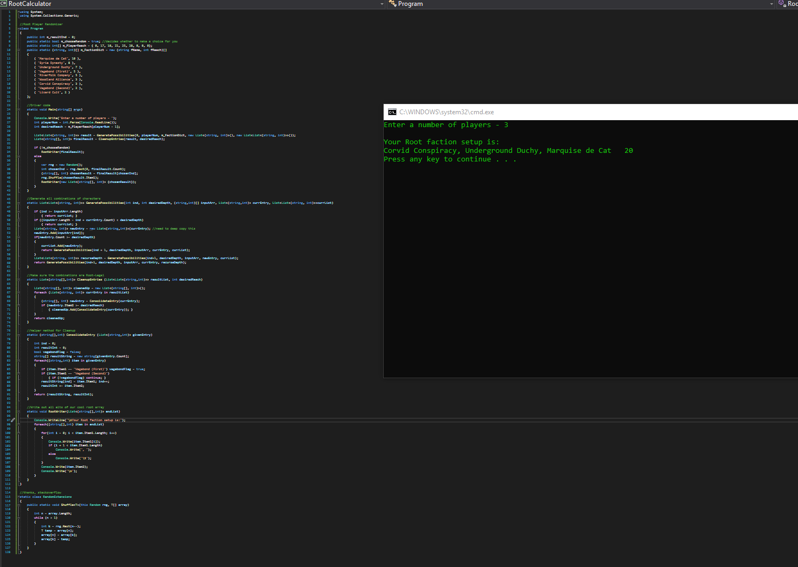
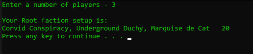

# Root_Faction_Randomizer
Randomly select viable faction combinations for the asymmetric board game Root.

This is just a little console app I wrote as a flashy "Hello World" for C# and the .NET framework.

1) Sit around a table, with your copy of Root.
2) Select a starting player.
3) Type your player count as an integer into the console window, then hit enter.
4) Assign your players to factions based on your result (first player is first faction listed, next player clockwise is second listed, etc.)

